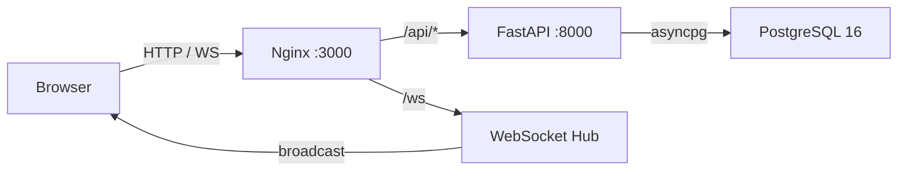

<div align="center">

#  Locker Management System

**A modern, real-time locker assignment platform for schools & universities.**

[](https://fastapi.tiangolo.com)
[](https://react.dev)
[](https://www.postgresql.org)
[](https://www.docker.com)
[](LICENSE)

</div>

---

## What is it?

The **Locker Management System** is a full-stack, production-ready web application built to simplify how educational institutions manage student locker assignments. From barcode-based student lookup to inclusive-status prioritization and real-time dashboard updates, it gives administrators the tools they need — and students a clear view of their own locker.

---

## Features

| Feature | Description |
|---------|-------------|
| **JWT Authentication** | Secure, stateless login with role-based access control (`admin` vs `user`). |
| **Student Management** | CRUD for students with barcode, course year, group, and inclusive status tracking. |
| **Locker Inventory** | Manage locker number, size, access type, capacity, floor, and live status. |
| **Assignment Lifecycle** | Assign lockers, release them, and keep a full history with timestamps. |
| **Live Dashboard** | Real-time stats on lockers, students, and assignments — no refresh needed. |
| **WebSocket Updates** | Changes broadcast instantly to all connected clients. |
| **Multi-Language UI** | React context-powered locale switching for diverse users. |
| **Email Ready** | Built-in SMTP integration via Python's `smtplib`. |
| **Auto-Generated API Docs** | Swagger UI & ReDoc served out of the box by FastAPI. |

---

## Architecture



- **Frontend**: React 18 + Vite, served by Nginx.
- **Backend**: FastAPI with async SQLAlchemy 2.0 and Alembic migrations.
- **Database**: PostgreSQL 16, exposed on host port `55432`.
- **Real-time**: Native FastAPI WebSocket connection manager.

---

## Quick Start (Docker)

```bash
cd locker-management-system

# 1. Create your environment file
cp .env.example .env   # or create .env manually

# 2. Build and run everything
docker-compose up --build
```

That's it. The app will automatically run migrations and seed sample data.

| Service | URL |
|---------|-----|
| Frontend SPA | http://localhost:3000 |
| Backend API | http://localhost:8000 |
| Swagger UI | http://localhost:8000/docs |
| ReDoc | http://localhost:8000/redoc |
| PostgreSQL | localhost:55432 |

Stop the stack:

```bash
docker-compose down
```

Wipe the database:

```bash
docker-compose down -v
```

---

## Environment Variables

Create a `.env` file in the project root. Sensible defaults are provided for local development.

| Variable | Default | Description |
|----------|---------|-------------|
| `POSTGRES_USER` | `locker_admin` | PostgreSQL username |
| `POSTGRES_PASSWORD` | `locker_secret_2026` | PostgreSQL password |
| `POSTGRES_DB` | `locker_db` | Database name |
| `POSTGRES_HOST` | `db` | DB container hostname |
| `POSTGRES_PORT` | `5432` | Internal DB port |
| `DATABASE_URL` | *(derived)* | Async SQLAlchemy URL |
| `DATABASE_URL_SYNC` | *(derived)* | Sync SQLAlchemy URL for Alembic |
| `SECRET_KEY` | `change-me-in-production` | **Change in production!** |
| `ALGORITHM` | `HS256` | JWT signing algorithm |
| `ACCESS_TOKEN_EXPIRE_MINUTES` | `60` | JWT lifetime |
| `BACKEND_CORS_ORIGINS` | `["http://localhost:3000","http://localhost:5173"]` | Allowed CORS origins |
| `FIRST_ADMIN_EMAIL` | `admin@locker.com` | Seeded admin email |
| `FIRST_ADMIN_PASSWORD` | `admin123` | Seeded admin password |
| `SMTP_HOST` | `smtp.gmail.com` | SMTP server host |
| `VITE_API_URL` | `http://localhost:8000` | Frontend API base URL |

> **Security tip**: Always override `SECRET_KEY`, `POSTGRES_PASSWORD`, `FIRST_ADMIN_PASSWORD`, and SMTP credentials before deploying to production.

---

## Local Development (without Docker)

### Backend

```bash
cd backend

python -m venv .venv
.venv\Scripts\activate        # Windows
# source .venv/bin/activate   # Linux/macOS

pip install -r requirements.txt

# Configure env vars (DATABASE_URL must point to a running PostgreSQL)

alembic upgrade head
python -m app.seed
uvicorn app.main:app --reload --port 8000
```

### Frontend

```bash
cd frontend
npm install
npm run dev
```

The Vite dev server runs at **http://localhost:5173**.

---

## Database Migrations

Migrations live in `backend/alembic/versions/` and run automatically on Docker startup.

| Migration | Description |
|-----------|-------------|
| `001` | Initial schema: users, students, lockers, assignments |
| `002` | Add email verification fields |
| `003` | Drop verification fields |
| `004` | Add barcode to students; link user → student |
| `005` | Add course year to students |
| `006` | Add maintenance locker status |
| `007` | Add inclusive/priority status to students |

Generate a new migration after changing models:

```bash
cd backend
alembic revision --autogenerate -m "describe_your_change"
alembic upgrade head
```

---

## Default Credentials

The seed script (`backend/app/seed.py`) creates these accounts on first startup:

| Role | Email | Password |
|------|-------|----------|
| Admin | `admin@locker.com` | `admin123` |
| User | `user@locker.com` | `user123` |

It also seeds **100 students** and **100 lockers** (`L-001` → `L-100`) using Faker. Re-running the seeder is idempotent.

---

## API Overview

All endpoints are prefixed with `/api/v1`. Full interactive docs are available at `/docs` and `/redoc`.

### Authentication

| Method | Endpoint | Description |
|--------|----------|-------------|
| `POST` | `/auth/login` | Obtain JWT access token |
| `GET`  | `/auth/me`  | Get current authenticated user |

### Users *(Admin only)*

| Method | Endpoint | Description |
|--------|----------|-------------|
| `GET`    | `/users/` | List all users |
| `POST`   | `/users/` | Create a user |
| `GET`    | `/users/{id}` | Get user by ID |
| `PUT`    | `/users/{id}` | Update user |
| `DELETE` | `/users/{id}` | Delete user |

### Students *(Admin only)*

| Method | Endpoint | Description |
|--------|----------|-------------|
| `GET`    | `/students/` | List / search students |
| `POST`   | `/students/` | Create a student |
| `GET`    | `/students/{id}` | Get student by ID |
| `PUT`    | `/students/{id}` | Update student |
| `DELETE` | `/students/{id}` | Delete student |

### Lockers *(Admin only)*

| Method | Endpoint | Description |
|--------|----------|-------------|
| `GET`    | `/lockers/` | List / filter lockers |
| `POST`   | `/lockers/` | Create a locker |
| `GET`    | `/lockers/{id}` | Get locker by ID |
| `PUT`    | `/lockers/{id}` | Update locker |
| `DELETE` | `/lockers/{id}` | Delete locker |

### Assignments

| Method | Endpoint | Description | Access |
|--------|----------|-------------|--------|
| `GET`    | `/assignments/` | List all assignments | Admin |
| `POST`   | `/assignments/` | Assign a locker to a student | Admin |
| `GET`    | `/assignments/{id}` | Get assignment by ID | Admin |
| `PUT`    | `/assignments/{id}` | Update assignment | Admin |
| `DELETE` | `/assignments/{id}` | Delete assignment record | Admin |
| `GET`    | `/assignments/my` | View my own assignment | User |

### Dashboard & Health

| Method | Endpoint | Description |
|--------|----------|-------------|
| `GET` | `/dashboard/stats` | Aggregated dashboard stats |
| `GET` | `/api/health` | Service health check |

---

## Data Models

### Student

| Field | Type | Notes |
|-------|------|-------|
| `id` | int | Primary key |
| `full_name` | string | Student's full name |
| `group` | string | Class / study group |
| `barcode` | string | Unique barcode identifier |
| `course` | int | Academic year (1–6) |
| `inclusive_status` | string | `none` / `disability` / `orphan` / `vision` / `hearing` / `other` |

### Locker

| Field | Type | Notes |
|-------|------|-------|
| `id` | int | Primary key |
| `number` | string | Unique locker ID, e.g. `L-042` |
| `size` | string | `small` / `medium` / `large` |
| `access_type` | string | `key` / `pin` |
| `capacity` | int | Max 1–2 students |
| `floor` | int | Building floor |
| `status` | string | `active` / `inactive` / `maintenance` |

### Assignment

| Field | Type | Notes |
|-------|------|-------|
| `id` | int | Primary key |
| `student_id` | int | FK → students |
| `locker_id` | int | FK → lockers |
| `assigned_at` | timestamp | Auto-set on creation |
| `released_at` | timestamp | Set when locker is released |

### User

| Field | Type | Notes |
|-------|------|-------|
| `id` | int | Primary key |
| `email` | string | Unique login email |
| `role` | string | `admin` / `user` |
| `student_id` | int | Optional FK → students |

---

## Real-Time Updates

The backend exposes a WebSocket endpoint at `ws://localhost:8000/ws`. Whenever an assignment or locker is modified, the server broadcasts an event to every connected client. The React frontend listens via `useWebSocket` and refreshes the relevant data automatically — no polling required.

---

## Project Structure

```
locker-management-system/
├── docker-compose.yml
├── LICENSE
├── openapi.yaml
├── README.md
├── .env                          # Not committed
├── backend/
│   ├── Dockerfile
│   ├── requirements.txt
│   ├── alembic.ini
│   ├── alembic/
│   │   ├── env.py
│   │   ├── script.py.mako
│   │   └── versions/             # Migration history
│   └── app/
│       ├── main.py               # FastAPI app entrypoint
│       ├── seed.py               # Database seeder
│       ├── core/                 # Config, security, deps, WebSocket
│       ├── db/                   # Async engine & session
│       ├── models/               # SQLAlchemy ORM models
│       ├── schemas/              # Pydantic schemas
│       ├── services/             # Business logic
│       └── routers/              # API route handlers
└── frontend/
    ├── Dockerfile
    ├── nginx.conf
    ├── package.json
    ├── vite.config.js
    ├── index.html
    └── src/
        ├── App.jsx
        ├── main.jsx
        ├── index.css
        ├── api/                  # Axios clients
        ├── components/           # Shared UI
        ├── context/              # Auth & Language contexts
        ├── hooks/                # Custom React hooks
        └── pages/                # Page components
```

---

## License

This project is licensed under the [MIT License](LICENSE) © 2026 Bekzat.
